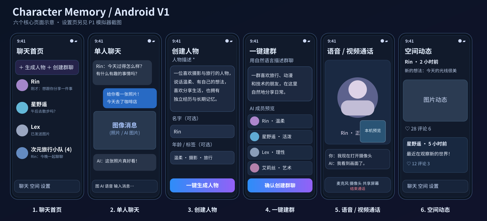
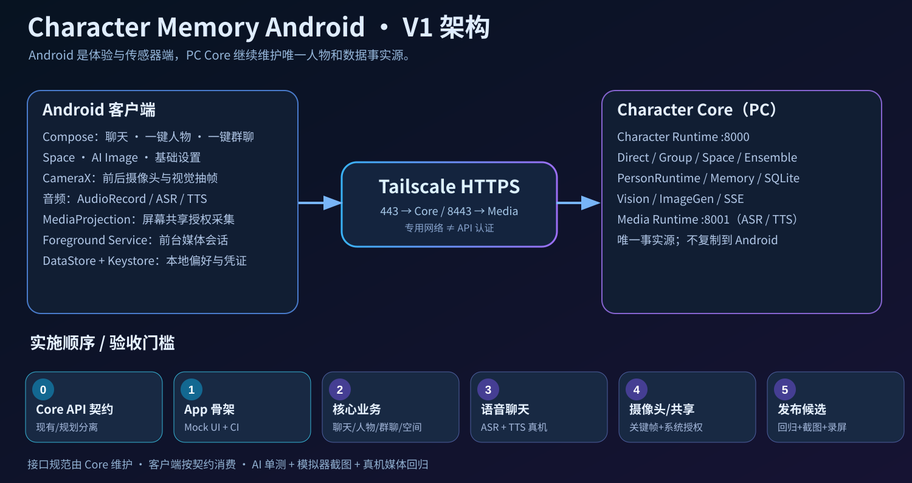

# Character Memory Android

> Character Memory 的 **Android 移动体验端 + 手机传感器端**，人物与记忆仍由 PC Core 维护。P2 客户端包含配置、私聊/群聊、人物/群组草稿、Space 和图片草稿；普通启动进入真实 API 模式，首次使用先填写服务器。P1 离线 Mock 保留为显式测试/演示入口。当前提交的构建和模拟器结果以对应 CI 为准，**真实 Core 与真机验收另行记录，不能由 Mock 结果推定通过**。

**PC Core 仓库：** [Initial-neko/character_memory](https://github.com/Initial-neko/character_memory)  
**权威 API 契约：** [Core — MOBILE_API_CONTRACT.md](https://github.com/Initial-neko/character_memory/blob/main/docs/current/MOBILE_API_CONTRACT.md) · [19 条已核对路由的机器可读清单](https://github.com/Initial-neko/character_memory/blob/main/docs/contracts/android-v1-route-inventory.json)  
**手机连接方案：** [Core — MOBILE_ACCESS.md](https://github.com/Initial-neko/character_memory/blob/main/docs/current/MOBILE_ACCESS.md)

## V1 产品原型

[单独查看六屏示意图](docs/assets/android-v1-six-screens.svg) · [架构图](docs/assets/android-v1-architecture.svg)

> 设计 SVG 仅展示**六个核心产品界面**；P1 实际另有一个**精简设置页**及群聊/生图弹窗等派生界面，均有独立的模拟器截图。设置页不是 SVG 第七张图，不能宣称六屏示意图覆盖所有 P1 页面。

> 仓库内的 SVG 为可版本化的功能结构示意，不等同于产品评审时生成的高保真 PNG；两张 PNG 原图待按 [设计资产 Issue #6](https://github.com/Initial-neko/character_memory_android/issues/6) 补录。后续开发要以经确认的高保真原图及实际屏幕截图共同验收。

V1 只包括与日常手机体验直接相关的功能：

| 屏幕/功能 | 用户体验 | Core 支持 / Android 工作 |
|---|---|---|
| 聊天主页 | 角色和群聊列表、消息预览、未读、进入会话 | 已有角色/群聊/摘要 API；跨端 read state 待统一 |
| 单人 / 群聊 | 文本、图片、表情、异步实时回复 | 已有 202 + SSE + history API；Android 实现客户端状态 |
| 一键生成人物 | 自然语言描述 → AI 草稿 → 预览确认 | 已有 draft/create API |
| 一键生成群聊 | prepare、恢复草稿、成员重试、预览和明确确认 | 使用 Core 已有 ensemble 生命周期 API |
| 语音聊天 | 麦克风、ASR、TTS、实时字幕、结束 | 已有 Media ASR/TTS + Core SSE；Android 原生音频 |
| 视频 / 屏幕视觉 | 摄像头前后切换、屏幕共享授权、抽关键帧供 LLM 理解 | 已有 Visual API；Android CameraX + MediaProjection |
| Space | 分页浏览、评论/回复、媒体播放 | 已有 Space API |
| 聊天 AI 图片 | 提示词生成草稿、确认后发送/查看 | 已有 ImageGen / Media API |
| 基础设置 | 连接状态、语音/视觉偏好、通知、外观 | Android 本地偏好 + 少量 Core 设备契约 |

**明确不进入 V1**：Dev Console、PC Settings 管理、TTS Workbench、密钥/模型配置、完整本地 LLM。当前另有可选的通话 Live2D 展示能力：Android WebView 复用 Core 已安装的渲染脚本和角色模型，支持全屏舞台及共享/视频小窗；不在 APK 分发 SDK，也不创建新的语音 Session。真实手机画面、动画及传感器验收单独记录。

## 总体架构

~~~text
Android Kotlin / Jetpack Compose
   ├── Chat / Character / Group / Space / Image UI
   ├── CameraX / AudioRecord / MediaProjection
   ├── Device status / Android permissions / Foreground Service
   └── REST + SSE (+ future device credential)
        │
        │ Tailnet HTTPS (phone must be connected to Tailscale)
        ├── https://<node>.<tailnet>.ts.net       → PC Core :8000
        └── https://<node>.<tailnet>.ts.net:8443  → PC Media :8001

Character Memory Core (the ONE authoritative PersonRuntime)
  Chat / Group / Space / Memory / Vision / ImageGen / ASR / TTS / SQLite
~~~

**Tailscale 是私网传输层，不是业务 API。** 当前 Core 和 Media 暴露两个 Serve origin；不要在 Android 中使用 `127.0.0.1` 当作 PC。设备配对凭证、服务端统一 Direct ID 和跨端 read state 是 **拟新增能力**，不能当作当前可调用路由。

## 文档入口

- [ARCHITECTURE.md](docs/ARCHITECTURE.md) — 运行边界、REST/SSE、设备与多模态职责。
- [DELIVERY_PLAN.md](docs/DELIVERY_PLAN.md) — P0~P5 分阶段实施、各阶段验收门槛。
- [TESTING.md](docs/TESTING.md) — AI 可执行的单测、模拟器、截图、Core 联调、真机验收矩阵。
- [P2_SETUP.md](docs/P2_SETUP.md) — 真实模式连接配置、会话边界、用户后端验收与 fixture 来源。
- [Core API Contract](https://github.com/Initial-neko/character_memory/blob/main/docs/current/MOBILE_API_CONTRACT.md) — **接口唯一事实源**，按 CURRENT/PROPOSED 标记现状。

## 当前 Android 工程栈

单 app module：Kotlin + Jetpack Compose、ViewModel + StateFlow、Coroutines、OkHttp/SSE、Gson、Coil（含同版本 SVG）与本地 SharedPreferences；JUnit/MockWebServer、Compose UI Test、Android Emulator/ADB。V1 已接入 AudioRecord、Media ASR/TTS、语音通话队列、Camera2 和 MediaProjection；设备凭证仍待 Core 契约。源码完成与当前 CI/真机验收结果分别记录。

先采用 **单 Gradle app module + feature package**，避免为了目录漂亮过早拆多个 Gradle modules。后端不能依赖 Android 私有实现，客户端不能直接操作 PC SQLite。

## 开发与验收阶段

| Phase | 目标 | Definition of Done |
|---|---|---|
| **P0：API 契约** | Core API 清单、请求/响应/错误/SSE、缺口 RFC | Core 文档和契约 fixture 与实际路由一致 |
| **P1：App 骨架** | Compose 六屏静态 UI + mock + CI | 可安装 APK、模拟器导航、截图对比 |
| **P2：核心体验** | 私聊/群聊/人物/Space/AI Image | 真 Core 上 202→SSE→历史对账闭环 |
| **P3：音频通话** | ASR/TTS、字幕、录放状态机 | 真机 Mic、播放、打断/结束验收 |
| **P4：视觉** | CameraX、屏幕授权、关键帧 | 真机前后摄像头、MediaProjection、正确角色视觉回复 |
| **P5：稳定性/发布** | 权限、连接重试、后台、通知、性能 | CI 产物 + logcat/录屏 + 真机验收报告 |

**阶段跟踪：** [P0 Core API](https://github.com/Initial-neko/character_memory/issues/213) · [P1 App 骨架](https://github.com/Initial-neko/character_memory_android/issues/1) · [P2 核心体验](https://github.com/Initial-neko/character_memory_android/issues/2) · [P3 语音](https://github.com/Initial-neko/character_memory_android/issues/3) · [P4 视觉](https://github.com/Initial-neko/character_memory_android/issues/4) · [P5 发布验收](https://github.com/Initial-neko/character_memory_android/issues/5)。

每次 PR 小步提交；MediaProjection/麦克风等系统能力不允许仅凭 Mock 测试声称真机可用。**未经真实授权和测试，不得声称可以后台持续屏幕共享。**

## 如何开始（当前状态）

仓库固定 **Gradle 8.9 Wrapper、JDK 17、compileSdk 35**。缓存完整时可运行 `./gradlew --offline --no-daemon lintDebug testDebugUnitTest assembleDebug`，Windows 使用 `gradlew.bat`。遇到分发包、SDK 或依赖缺失即报告阻塞；不要擅自下载、升级或复用不兼容的全局 Gradle。CI 使用现有配置生成 APK、JUnit、截图、logcat 和 JSON 证据。Windows 环境说明见 [LOCAL_ANDROID_SETUP.md](docs/LOCAL_ANDROID_SETUP.md)。

安装后按 [P2_SETUP.md](docs/P2_SETUP.md) 配置真实 Core/Media；Android 现在请求网络权限，但没有录音、摄像头或录屏能力。P1 原型基线见 [P1_ACCEPTANCE.md](docs/P1_ACCEPTANCE.md)。Core #213 的 canonical Direct ID、跨端 read state 和设备凭证迁移不属于 P2；当前客户端不会自动同步 Web 会话，也不会声称完成设备认证。原始高保真 PNG 仍由 Issue #6 跟踪。

所有后端 API 变更必须先或同步进入 Core 仓库契约，更新客户端 fixtures 和兼容性说明。不要在 Android 仓库维护一份会漂移的私有 API 定义。

---

Character Memory 始终是同一个 Persistent Person。Android 扩展的是它能交互、看见和听见的渠道，而不是再制造一套人物或记忆。

## 助手工具

[Live2D 全流程 skill](skills/live2d-psd-preview/SKILL.md) 覆盖角色图像优化 / 生成、PSD 拆层与检查、离线程序导出、局部修正、模型打包和真实预览。该工具包独立于 Android App；依赖用户已有工具和缓存，密钥只从显式 `.env` 读取，仓库仅包含空值模板。完整命令见 [工作流程](skills/live2d-psd-preview/references/full-workflow.md)。
